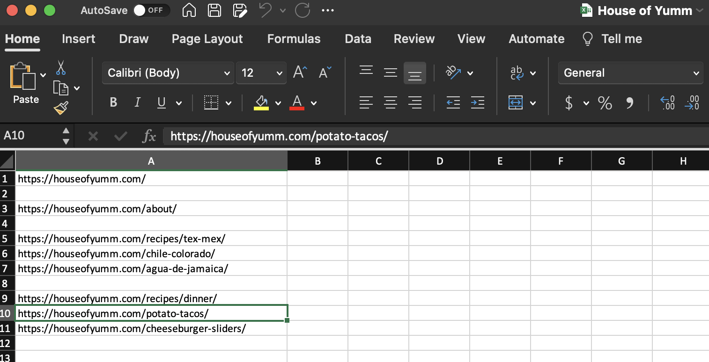

# Web-Scraping-with-Beautiful-Soup

This repository gives code to scrape a series of websites for web content and transfer select items to a word document.

## Overview

Web scraping is the act of gathering data from html files on the web and processing the data in some way.
One use of webscraping is to assist website migration from an old site to a new site. Sometimes in site migration, hundreds
of webpages such as an archive of blog posts need to be transferred, a time consuming process. A common strategy is to copy
and paste all relevant bodies of text by hand from the old website into the new webpages.
Webscraping can assist this process by automatically gathering all the relevant content in one organized document.

This code allows a user to create an excel doc with a list of websites, in this instance, a series of webpages on a food blog's
website, and scrape it using a python package called beautiful soup. It saves the scraped information in a docx file,
maintaining the formatting (heading 1,2,3, numbered and unnumbered lists, etc.) In a webpage's HTML, there are various 
elements that are irrelevant to migrating the content, such as banner and foot elements. This webscraping code has a simple 
version that scrapes all content and transfers it to a docx file, and a more advanced algorithm that looks for relevant elements 
that have the marks of "content", and only scraped those elements. The docx file becomes a sort of organized repository for the site
content, allowing the content to be migrated to the new site with greater ease. When the content is copied, each webpage will be
separated with a heading.

## Walkthrough

Above is a blog on potato tacos from a recipe website HouseofYumm.com. Suppose we want to copy all the content from this website into an organized word doc that will act as a repository.

The first step is to make an excel document, and write each page to be scraped in the first column entries.

Running the second block in the jupyter notebook (referencing the appropriate .xlsx document in the code), we scrape all the content from each website. Each website has a header, and the content keeps its formatting.
